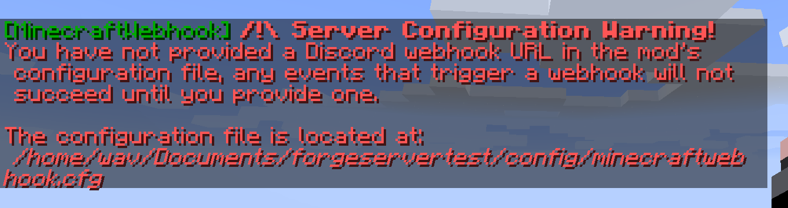
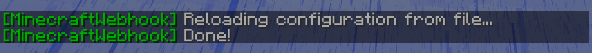
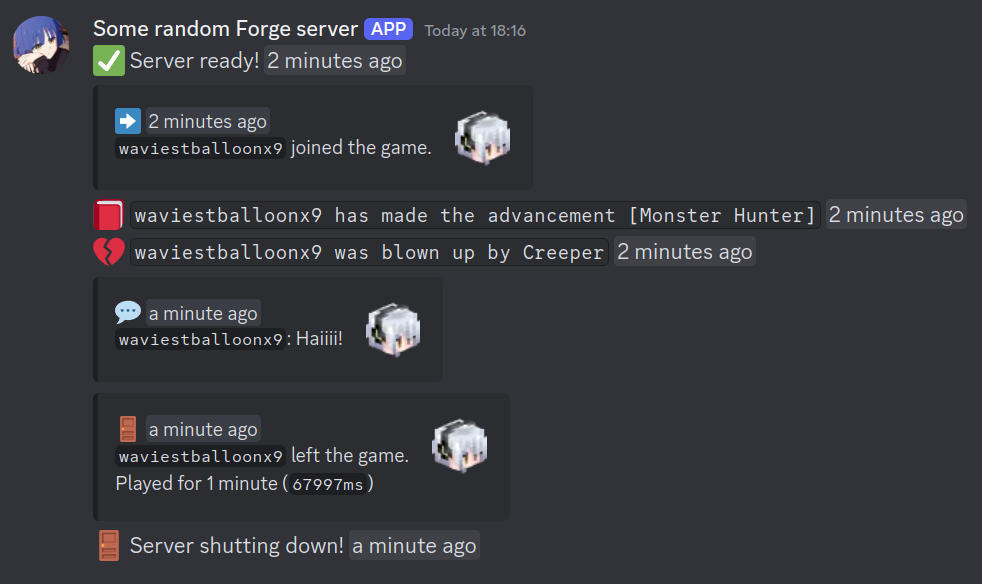

#  MinecraftWebhook
### MinecraftWebhook is a easy to use and customisable mod that relays in-game events to a Discord Webhook.

*You can relay:*
- Player joins
- Player leaves
- Player getting an advancement
- Player dying
- Player chat messages
- Server shutdowns
- Server started

## How to setup
> [!NOTE]
> Since this is a server-sided mod, it is best practice to not include it in your client's mods folder to save up on space and loading times.

1. Install the mod on the server
2. (Re)start the server and wait for it to finish initialising
3. Join the server and you should see this warning message get sent in chat:


5. Create a Discord webhook and copy the webhook URL, you can follow [the official Discord guide on how to use webhooks here](https://support.discord.com/hc/en-us/articles/228383668-Intro-to-Webhooks)
6. Open the configuration file, the location of the file is outlined in the warning message when you joined the server
7. Paste the webhook URL you copied previously and paste it into the `S:DiscordWebhookURL` variable, it should look something like this but not all `X`s:
```
# DO NOT SHARE THIS URL WITH ANYONE [default: ]
S:DiscordWebhookURL=https://discord.com/api/webhooks/xxxxxxxxxxxxxxxxxxx/XXXXXXXXXXXXXXXXXXXXXXXXXXXXXXXXXXXXXXXXXXXXXXXXXXXXXXXXXXXXXXXXXXXX
```

8. Run the `/mwreload` command to make the changes take place (You can do this in the server's console or, if you have operator permissions, run it in chat)


9. Start triggering enabled events! You should see the webhook send messages in the channel you made it in:



